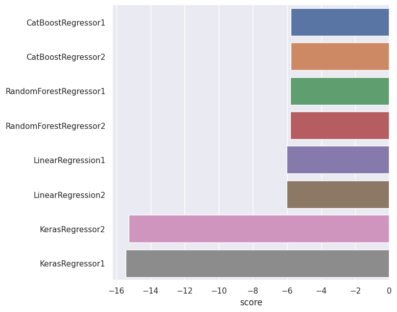
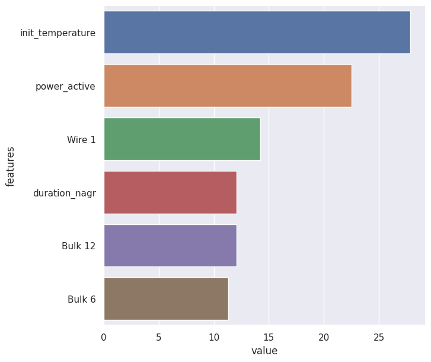

# Резюме работы
Перед нами предстояла следующая __цель__: 
Оптимизировать производственные расходы, уменьшить потребление электроэнергии на этапе обработки стали. 
Построить модель, которая предскажет температуру стали.

Для решения задачи были предприняты следующие шаги:  
* Предобработка данных:
        - Выявлены артефактные значения в реактивной энергии, поэтому была была исключена одна партия вовсе;
        - Пропущенные значения в объёмах подачи материалов заполнены нулём;
        - Исходные данные с временем подачи сыпучих и проволочных материалов не были взяты в анализ;
        - Собраны два новых датасета для моделирования;
        - В новых датасетах, были исключены из анализа партии, не имеющие финального замера температуры и устранены 
        выбросы в замерах начальной температуры, что  привело к потере 28.29 % всего данных; 
        - Мультиколлиярности не выявлено, но признак 'Wire 5' был исключен из анализа, потому что не имеет значений. 
* Моделирование:  
Изначально была цель, взять две базовые модели на разных принципах - LinearRegression ( построение линейной гиперплоскости) и RandomForestRegressor (построение решающих деревьев), оценить их результат. Далее применить модель с градиентным бустингом CatBoostRegressor для увеличения качества модели. И планировалось, что самой сильной моделью выступит нейронная сеть на KerasRegressor. Но нейронная сеть здесь не сработала.  
Все эксперименты проводились по такому сценарию:  
Подготовленный датасет -> __Pipeline__ (применяем здесь только масштабирование) -> __GridSearchCV__ (здесь подбираем гиперпараметры модели и кросс-валидация) -> Получаем метрику __MAE по модели с наилучшими гиперпараметрами__. 

Результат моделирования представлен на графике:  
По оси х отмечено значения метрики MAE.  
По оси y отмечена наименование модели и значение в конце, какой датасет используется. 

Была выбрана модель CatBoostRegressor, которая показала наименьшую метрику MAE = 6.24 на контрольной проверке. 

После была проведена оценка важности факторов в модели, результат представлен на графике: 

Заказчику важно следить за следующими параметрами для контроля температуры:  
* Начальной температурой сплава;
* Активной мощностью;
* Продолжительность нагрева;
* Объём подачи проволочного материала Wire 1;
* Объём подачи сыпучего материала Builk 12;
* Объём подачи сыпучего материала Builk 6.  

Мы провели повторный контрольный замер, после удаления "неважных" признаков. Метрика изменилась в худшую сторону на 0.009. Это очень мало. Поэтому подверддаем, что эти признаки неважны.  

Теперь интерпретируем результат.  
По сути наша цель оптимизация расхода материалов и электроэнергии. Целевой признак мы можем заменить на изменение температуры (фильнальный замер - начальный замер) и если бы у нас была возможность перевести всё в денежный эквивалент, то мы могли бы вычислить, самый дешевый способ из комбинации входных параметров для получения большего нагрева. - тем самым задачу для снижения расходов, мы бы решили.
 
# Навыки
 __pandas__,  __numpy__, __CatBoost__,  __seaborn__, __sklearn__, __LinearRegression__, __RandomForestRegressor__, __Pipeline__, __GridSearchCV__, __KerasRegressor__, __MAE__
